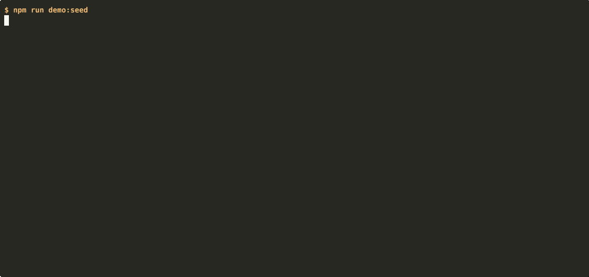

# Marrow

[](https://github.com/gnosislabstech/marrow/actions/workflows/ci.yml)

**Self-hosted semantic + lexical search over your AI coding sessions and notes.
Every answer cites its source, and your corpus never leaves infrastructure you
control.**



You accumulate thousands of Claude Code sessions — decisions, debugging arcs,
the *why* behind the code. This engine ingests that corpus into your own
database and lets you ask it questions, with every result traced back to a real
turn in a real session. No phone-home, no shared backend, no answer without a
citation.

> The product name is configurable (`CB_PRODUCT_NAME`) and not load-bearing —
> nothing in the code branches on it.

## Try it in 60 seconds (zero key)

A disposable local stack (pgvector + PostgREST) seeded with a small synthetic
corpus, exercising the real retrieval path with no API key:

```bash
npm install
npm run demo:up      # pgvector + PostgREST
npm run demo:seed    # schema + synthetic corpus
npm run demo         # cited results
npm run demo:down
```

See [`quickstart/README.md`](quickstart/README.md) for the full walkthrough,
including the one-time keyed step that enables the semantic (match-by-meaning)
demo.

## How it works

| Stage | What happens |
|---|---|
| **Ingest** | Stream-parse session transcripts → turn windows → privacy pre-scan → embed |
| **Store** | Postgres + pgvector (`halfvec(1024)`), RLS deny-by-default |
| **Retrieve** | Hybrid: pgvector cosine + `tsvector` lexical, fused by Reciprocal Rank Fusion |
| **Rerank** | Optional cross-encoder rerank of the top candidates |
| **Answer** | Synthesized response with `[N]` citations to the source chunks |

Embeddings come from [Voyage](https://www.voyageai.com/) (default `voyage-4`,
1024-dim). Retrieval-prefix generation (Contextual Retrieval) can use Anthropic
or DeepSeek. All providers use **your** API keys; see [SECURITY.md](SECURITY.md).

## What it indexes

- **Claude Code sessions** — the standard `~/.claude/projects` tree (the default
  source).
- **Optional exports** — Claude.ai, ChatGPT, and Telegram conversation exports,
  and a generic markdown "memory" directory. Configure these in
  `src/sources.config.ts` (copy `src/sources.config.ts.example`).

## Bring your own corpus

1. Provision Postgres with `pgvector` ≥ 0.7 (a Supabase project works out of the
   box, or any PostgREST + pgvector).
2. Apply the migrations in `supabase/migrations/`.
3. Copy `.env.example` → `.env` and fill in your database + Voyage credentials.
4. (Optional) copy `src/sources.config.ts.example` → `src/sources.config.ts` to
   point at your own corpus.
5. Ingest:

   ```bash
   npm run bootstrap:dry   # count + cost estimate, no writes
   npm run bootstrap       # live ingest
   ```

Then search from the CLI (`cb search` / `cb answer`) or wire the MCP server into
your editor.

## Configuration

Everything owner-, brand-, or model-specific lives in `src/config.ts` with
neutral defaults, overridable via environment variables:

| Env | Default | Purpose |
|---|---|---|
| `CB_PRODUCT_NAME` | `Marrow` | Display name in banners / prompts |
| `CB_CLI_NAME` | `cb` | CLI name in help text |
| `EMBEDDING_MODEL` | `voyage-4` | Embedding model |
| `RERANKER_MODEL` | `rerank-2.5-lite` | Reranker model |
| `DEFAULT_OWNER` | `owner` | Owner key scoping rows |

Secret keys (database, Voyage, etc.) come from your environment — see
`.env.example`.

## What it deliberately omits

This is the **engine**: ingest, retrieve, cite. It does not profile you, build
recommendations, or layer analytics on top of your corpus. Those are out of
scope here by design. The engine's job is faithful, cited recall — nothing more.

## Develop

```bash
npm test          # node:test suite
npm run typecheck # tsc --noEmit
```

Contributions welcome by discussion — see [CONTRIBUTING.md](CONTRIBUTING.md).
Licensed under [Apache 2.0](LICENSE).

---

Marrow is the open-core release of the retrieval engine
[Gnosis Labs](https://gnosislabs.tech) runs in production. The analytics and
insight layers above it stay closed; the engine — ingest, retrieve, cite — is
all here. Maintainer contact: cap@gnosislabs.tech (security reports: see
[SECURITY.md](SECURITY.md)).
